# SIMI CENTRAL 

[](https://github.com/sicaboy/simi-central/actions/workflows/ci.yml)

## 项目概述

Simi Central 是一个多租户 SaaS 平台的中央管理系统。它负责用户认证、订阅计费、租户配置，并作为协调各个租户应用程序的中央枢纽。

### 系统架构

本项目由两个主要部分组成：

1. **Central（本项目）**：处理用户管理、订阅计费、租户配置和跨租户操作
2. **Tenant**：独立的商店实例，包含店铺前台、预约系统、礼品卡销售、客户反馈和商家后台

### 核心组件

- **多租户架构**：使用 Laravel Tenancy，每个租户拥有独立数据库
- **订阅管理**：Laravel Cashier 集成 Stripe 订阅功能
- **域名管理**：支持自定义域名和子域名
- **Webhook 系统**：双重 Stripe webhook 架构，用于不同目的

## Stripe Webhook 架构

系统实现了两个不同的 Stripe webhook 端点，用于不同目的：

### 1. 订阅 Webhook (`/webhook/stripe`)
- **用途**：处理订阅相关事件（计费、套餐变更、取消）
- **位置**：`shared-saas/routes/central.php` → `WebhookStripeController::handleWebhook`
- **范围**：中央订阅管理
- **事件**：`customer.subscription.created`、`customer.subscription.updated`、`customer.subscription.deleted`
- **原因**：租户订阅数据存储在中央数据库中，且租户可能有不同的子域名/自定义域名，使得 Stripe 直接通信具有挑战性

### 2. 租户 Webhook 代理 (`/webhook/stripe-connect`)
- **用途**：作为租户特定支付事件的反向代理
- **位置**：`routes/central.php` → `WebhookController::stripeConnect`
- **范围**：单个租户订单/支付处理
- **流程**：
  1. Stripe 发送 webhook 到 Central
  2. Central 通过 `stripe_account_id` 识别租户
  3. Central 将 webhook 转发到租户域名
- **原因**：在保持中央化 webhook 管理的同时，实现租户特定的支付处理

### 系统架构

以下图表展示了完整的系统架构和 webhook 流程：

```mermaid
graph TB
    subgraph "Stripe"
        S[Stripe Platform]
        S1[Subscription Events]
        S2[Payment Events]
    end

    subgraph "Simi Central"
        subgraph "Webhook System"
            WH1["/webhook/stripe<br/>WebhookStripeController"]
            WH2["/webhook/stripe-connect<br/>WebhookController"]
        end
        
        subgraph "Central Database"
            CDB[(Central DB)]
            USERS[Users & Teams]
            SUBS[Subscriptions]
            TENANTS[Tenants]
            DOMAINS[Domains]
        end
        
        subgraph "Services"
            SS[SubscriptionService]
            SWL[StripeWebhookListener]
        end
    end

    subgraph "Tenant Applications"
        T1[Tenant Store 1<br/>custom-domain.com]
        T2[Tenant Store 2<br/>shop.simi.com.au]
        T3[Tenant Store N<br/>another-domain.com]
        
        subgraph "Tenant Features"
            TF1[Storefront]
            TF2[Booking System]
            TF3[Gift Cards]
            TF4[Customer Feedback]
            TF5[Merchant Backend<br/>商家后台]
        end
        
        subgraph "Tenant Database"
            TDB[(Tenant DB)]
            ORDERS[Orders]
            PRODUCTS[Products]
            CUSTOMERS[Customers]
        end
    end

    %% Stripe to Central connections
    S1 --> WH1
    S2 --> WH2

    %% Central webhook processing
    WH1 --> SS
    WH1 --> SWL
    WH2 --> T1
    WH2 --> T2
    WH2 --> T3

    %% Central database connections
    SS --> CDB
    SWL --> CDB
    USERS --> CDB
    SUBS --> CDB
    TENANTS --> CDB
    DOMAINS --> CDB

    %% Tenant connections
    T1 --> TDB
    T2 --> TDB
    T3 --> TDB
    
    TF1 --> TDB
    TF2 --> TDB
    TF3 --> TDB
    TF4 --> TDB
    TF5 --> TDB
    
    ORDERS --> TDB
    PRODUCTS --> TDB
    CUSTOMERS --> TDB

    %% Styling
    classDef stripe fill:#6772e5,stroke:#333,stroke-width:2px,color:#fff
    classDef central fill:#28a745,stroke:#333,stroke-width:2px,color:#fff
    classDef tenant fill:#17a2b8,stroke:#333,stroke-width:2px,color:#fff
    classDef database fill:#ffc107,stroke:#333,stroke-width:2px,color:#000

    class S,S1,S2 stripe
    class WH1,WH2,SS,SWL central
    class T1,T2,T3,TF1,TF2,TF3,TF4,TF5 tenant
    class CDB,TDB,USERS,SUBS,TENANTS,DOMAINS,ORDERS,PRODUCTS,CUSTOMERS database
```



### Webhook 流程总结

```
Stripe → Central (/webhook/stripe) → 订阅管理 (Central DB)
       ↓
Stripe → Central (/webhook/stripe-connect) → 租户域名 → 订单处理 (Tenant DB)
```

## 开发环境

### 前置要求

- Docker & Docker Compose
- PHP 8.3+
- Composer
- Node.js 18+ & NPM

### 环境搭建

1. **安装平台依赖**
   ```bash
   # 在 https://github.com/sicaboy/platform 运行 Docker
   ```

2. **启动开发环境**
   ```bash
   docker-compose up -d --build --remove-orphans
   ```

3. **安装依赖**
   ```bash
   composer install
   npm install
   ```

4. **数据库设置**
   ```bash
   php artisan migrate
   php artisan db:seed
   ```

### 前端开发

**开发模式**
```bash
# 开发环境下运行
npm run dev

# 监听文件变化
npm run watch

# 生产环境构建
npm run production
```

## Stripe 开发与测试

### Stripe CLI 设置

```bash
stripe login
# 使用 Central 账户登录
```

### Webhook 测试

本地测试 webhooks：

```bash
# 订阅 webhooks (Central)
stripe listen --forward-to http://localhost:8053/webhook/stripe

# 租户支付 webhooks (代理)
stripe listen --forward-to http://localhost:8053/webhook/stripe-connect
# 或特定租户域名
stripe listen --forward-to http://lijun-shen.simi.localhost:8059/webhook/stripe-connect
```

### 测试 Webhook 事件

```bash
# 测试订阅 webhook 监听器
php artisan test:stripe-webhook
```

## 配置

### 环境变量

Stripe 集成的关键环境变量：

```env
# Stripe 配置
STRIPE_KEY=pk_test_...
STRIPE_SECRET=sk_test_...
STRIPE_WEBHOOK_SECRET=whsec_...
STRIPE_WEBHOOK_CONNECT_SECRET=whsec_...

# Cashier 配置
CASHIER_CURRENCY=usd
CASHIER_PAYMENT_NOTIFICATION=true

# 套餐价格 ID
STRIPE_PROFESSIONAL_MONTHLY_PRICE_ID=price_...
STRIPE_PROFESSIONAL_YEARLY_PRICE_ID=price_...
STRIPE_BUSINESS_MONTHLY_PRICE_ID=price_...
STRIPE_BUSINESS_YEARLY_PRICE_ID=price_...
```

### 订阅套餐

系统支持多个订阅层级：
- **免费版**：基础功能，使用限制
- **专业版**：为小企业提供增强功能
- **商业版**：企业级功能
- **企业版**：定制解决方案

套餐配置定义在 `shared-saas/config/subscription.php`。

## 数据库架构

### 中央数据库
- **Users**：系统用户和认证
- **Teams**：用户组织和计费实体（Laravel Cashier 的 Billable 实体）
- **Tenants**：具有 `stripe_account_id` 的独立商店实例，用于 Stripe Connect
- **Subscriptions**：由 Laravel Cashier 管理的计费和订阅数据
- **Domains**：带有 SSL 证书状态的自定义域名管理
- **Plans**：带有 Stripe 价格 ID 的订阅套餐定义
- **Features**：功能定义和套餐关联

### 租户数据库（按租户隔离）
- **Orders**：带有 Stripe 会话跟踪的电商交易
- **Products**：商店库存和目录
- **Customers**：带有 Stripe 客户 ID 的商店客户数据
- **Settings**：包括 Stripe 账户设置的租户特定配置
- **Gift Cards**：礼品卡订单和交易
- **Payments**：支付处理记录

### 关键关系
- `Teams` → `Subscriptions` (1:N) - 团队可以有多个订阅（通过 Laravel Cashier）
- `Teams` → `Tenants` (1:1) - 每个团队拥有一个租户商店
- `Tenants` → `Domains` (1:N) - 租户可以有多个域名
- `Tenants` 具有 `stripe_account_id` 用于 Stripe Connect 集成
- 订阅计费主体是 `Teams`，而不是 `Tenants`

## API 端点

### 中央 API
- `POST /api/contact/sales` - 销售咨询
- `POST /api/newsletter/subscribe` - 邮件订阅
- `GET /api/newsletter/status` - 邮件订阅状态

### Webhook 端点
- `POST /webhook/stripe` - 订阅 webhooks
- `POST /webhook/stripe-connect` - 租户支付 webhooks

## 监控与日志

### Webhook 监控
所有 webhook 事件都会记录详细信息：
- 事件类型和载荷
- 处理状态
- 错误处理和重试

### 订阅事件
- 订阅创建、更新和取消
- 支付成功/失败通知
- 试用期管理

## 安全性

### Webhook 安全
- Stripe 签名验证
- 环境特定的 webhook 密钥
- 请求载荷验证
- webhook 端点的 CSRF 保护排除

### 多租户安全
- 每个租户的数据库隔离
- 基于域名的租户识别
- 安全的租户切换和模拟

## 技术栈

### 核心依赖
项目基于以下主要依赖构建：
- **PHP**: ^8.3
- **Laravel Framework**: ^10.48.28
- **Laravel Cashier**: ^13.0+（通过 shared-saas 包）
- **Stripe PHP SDK**: ^7.128
- **Inertia Laravel**: ^0.6.11

### 后端
- **Laravel 10**：PHP 框架，配备 Eloquent ORM
- **Laravel Tenancy**：数据库分离的多租户架构（Stancl/Tenancy）
- **Laravel Cashier**：Stripe 订阅管理
- **Laravel Sanctum**：API 认证
- **Shared SaaS Package**：自定义的多租户 SaaS 包
- **PHP 8.3**：现代 PHP 版本支持

### 前端
- **Vue.js 3**：渐进式 JavaScript 框架
- **Inertia.js**：现代单体应用方法
- **Tailwind CSS**：实用优先的 CSS 框架
- **Laravel Mix**：前端构建工具（基于 Webpack）
- **Headless UI**：无样式 UI 组件
- **Heroicons**：SVG 图标库

### 基础设施
- **MySQL**：主数据库
- **Redis**：缓存和会话存储
- **Docker**：容器化（使用 Nginx Unit）
- **Cloudflare**：CDN 和自定义域名 SSL

### 支付处理
- **Stripe**：支付处理和订阅管理
- **Stripe Connect**：租户的多方支付

## 部署

### Docker 部署
```bash
# 构建并启动服务
docker-compose up -d --build

# 运行迁移
docker-compose exec app php artisan migrate

# 安装前端依赖并构建
docker-compose exec app npm install
docker-compose exec app npm run production
```

### 环境配置
确保设置所有必需的环境变量：
- 数据库凭据
- Stripe API 密钥和 webhook 密钥
- Redis 连接设置
- Cloudflare API 令牌（用于自定义域名）
- 多租户配置（租户前缀等）

## 测试

### 单元测试
```bash
php artisan test
```

### Webhook 测试
```bash
# 测试订阅 webhooks
php artisan test:stripe-webhook

# 使用 Stripe CLI 测试
stripe trigger customer.subscription.created
```

## 贡献

1. Fork 仓库
2. 创建功能分支
3. 进行更改
4. 为新功能添加测试
5. 提交 pull request

## 许可证

本项目为专有软件。保留所有权利。
